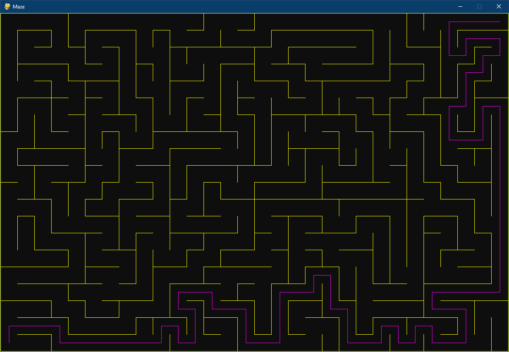

# Controls

| Key        | Action                 |
| ---------- | ---------------------- |
| Q          | Quit                   |
| R          | Random maze generation |
| Mouse left | Set the start          |
| Mouse end  | Set the end            |

# Implementations

- Maze generation : [https://en.wikipedia.org/wiki/Maze_generation_algorithm#Randomized_Depth-First_Search]()
- Search algorithm : [https://en.wikipedia.org/wiki/A*_search_algorithm]()
- Rendering : [https://www.pygame.org]()

# Example

